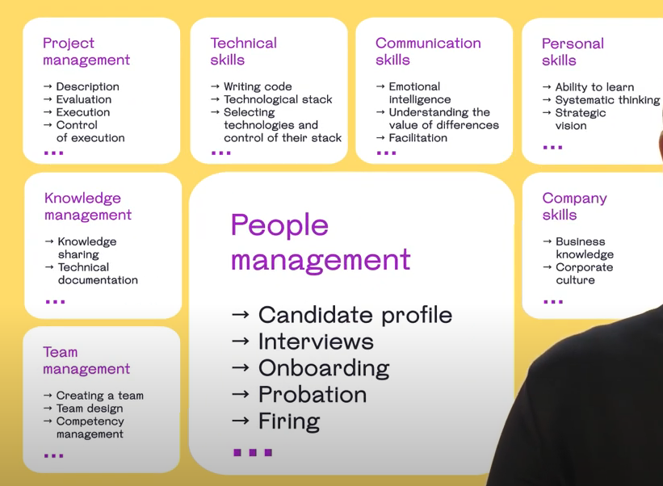

# engineering career note

##  software engineer career ladder

### small company
Software Developer 1 => Software Developer 2 => Senior Software Developer => Software Developer 2

1. Individual Contributor:  Architect / Principal Architect
2. People Management: Technical Lead / Engineering Manager

### bigger company

## manager toolkits

### skill matrix

### career path template

### reviews

### 1 on 1 meetings

### professional development plan (PDP)

## build a team

## reference
1. [career doc](https://www.vectorly.team/pdf/career-path-guide)
2. [must read book](https://irina-seng.medium.com/top-20-books-a-software-developer-must-read-updated-b24bcc9ee3d)
